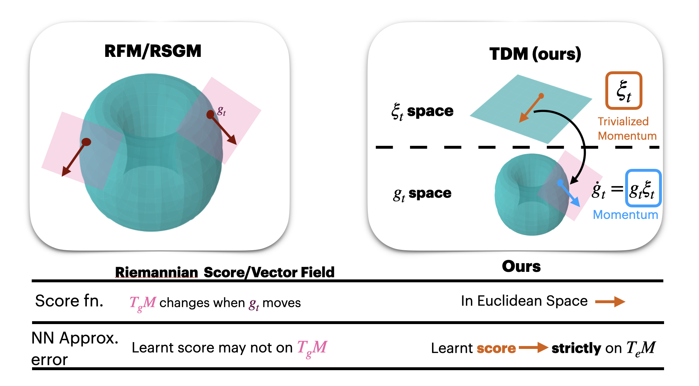

# Official Repo for paper "Trivialized Momentum Facilitates Diffusion Generative Modeling on Lie Groups" (TDM)

[](LICENSE)
[](https://arxiv.org/abs/2405.16381)


**Abstract:**
The generative modeling of data on manifold is an important task, for which diffusion models in flat spaces typically need nontrivial adaptations. This article demonstrates how a technique called `trivialization' can transfer the effectiveness of diffusion models in Euclidean spaces to Lie groups. In particular, an auxiliary momentum variable was algorithmically introduced to help transport the position variable between data distribution and a fixed, easy-to-sample distribution. Normally, this would incur further difficulty for manifold data because momentum lives in a space that changes with the position. However, our trivialization technique creates to a new momentum variable that stays in a **simple fixed vector space**. This design, together with a manifold preserving integrator, simplifies implementation and avoids inaccuracies created by approximations such as projections to tangent space and manifold, which were typically used in prior work, hence facilitating generation with high-fidelity and efficiency. The resulting method achieves state-of-the-art performance on protein and RNA torsion angle generation and sophisticated torus datasets. We also, arguably for the first time, tackle the generation of data on high-dimensional Special Orthogonal and Unitary groups, the latter essential for quantum problems.

## Highlight

*******************************


## Installation

For `Conda` installation:
```
conda env create -f requirements.yaml
conda activate tdm
bash setup/conda_setup.sh
```

## Training: example usage for ISM
```
# SO(N)
python main.py --problem-name SOn --SON $SON_DIM --dir $DIR 
            --snapshot-freq $EVAL_FREQ --gpu $GPU --num-itr $TRAIN_ITER 
            --interval $EVAL_NFE --samp-bs $EVAL_BATCH_SIZE
            --random-x-t --Integrator Exp --resample-itr $RESAMPLE_FREQ  
            --T 5 --t0 1e-2 --model-hidden-dim $MODEL_HID_DIM 
            --model-blocks $MODEL_DEPTH

# U(N) (Quantum Oscillator)
python main.py --problem-name Un --UN $UN_DIM --dir $DIR 
            --snapshot-freq $EVAL_FREQ --gpu $GPU --num-itr $TRAIN_ITER 
            --interval $EVAL_NFE --samp-bs $EVAL_SAMPLE_BATCH 
            --random-x-t --Integrator Exp --resample-itr $RESAMPLE_FREQ
            --T 5 --t0 1e-2 --model-hidden-dim $MODEL_HID_DIM 
            --model-blocks $MODEL_DEPTH

# U(N) (Spin Glass)
python main.py --problem-name SpinGlass --spin-num $NUM_SPIN --dir $DIR 
            --snapshot-freq $EVAL_FREQ --gpu $GPU --num-itr $TRAIN_ITER 
            --interval $EVAL_NFE --samp-bs $EVAL_SAMPLE_BATCH 
            --random-x-t --Integrator Exp --resample-itr $RESAMPLE_FREQ
            --T 5 --t0 1e-2 --model-hidden-dim $MODEL_HID_DIM 
            --model-blocks $MODEL_DEPTH

```

## Training: example usage for ISM
```
#Protein General/Glycine/PrePro/Proline
python main.py  --problem-name Protein --Protein-name $PROTEIN --dir $DIR  
            --snapshot-freq $EVAL_FREQ --num-itr $TRAIN_ITER 
            --interval $EVAL_NFE --gpu $GPU --ckpt-freq $CKPT_FREQ 
            --train-bs-x $TRAIN_BATCH_SIZE --Integrator Exp 
            --loss dsm --T 15 --t0 1e-2 --model-hidden-dim $MODEL_HID_DIM 
            --model-blocks $MODEL_DEPTH

# RNA
python main.py --problem-name RNA --dir $DIR  
            --snapshot-freq $EVAL_FREQ --num-itr $TRAIN_ITER 
            --interval $EVAL_NFE --gpu $GPU --ckpt-freq $CKPT_FREQ 
            --train-bs-x $TRAIN_BATCH_SIZE --Integrator Exp 
            --loss dsm --T 15 --t0 1e-2 --model-hidden-dim $MODEL_HID_DIM 
            --model-blocks $MODEL_DEPTH

#Checkerboard
python main.py  --problem-name Checkerboard 
            --checker-board-pattern-num $PATTERN_NUM --dir $DIR  
            --snapshot-freq $EVAL_FREQ --num-itr $TRAIN_ITER 
            --interval $EVAL_NFE --gpu $GPU --ckpt-freq $CKPT_FREQ 
            --train-bs-x $TRAIN_BATCH_SIZE --Integrator Exp 
            --loss dsm --T 15 --t0 1e-2 --model-hidden-dim $MODEL_HID_DIM 
            --model-blocks $MODEL_DEPTH

#Pacman
nohup python main.py  --problem-name Pacman --dir $DIR  
            --snapshot-freq $EVAL_FREQ --num-itr $TRAIN_ITER 
            --interval $EVAL_NFE --gpu $GPU --ckpt-freq $CKPT_FREQ 
            --train-bs-x $TRAIN_BATCH_SIZE --Integrator Exp 
            --loss dsm --T 15 --t0 1e-2 --model-hidden-dim $MODEL_HID_DIM 
            --model-blocks $MODEL_DEPTH

```


## Results
You can check out the training results and saved checkpoint in the `/result` folder.


## Synthetic Data Generation
```
python data_generation/data_prepare.py
```
The configs are specified in  `data_generation/config.yaml`.

Generated dataset can be found under directory `dataset/` 

Current support data type: 
* SO(n) matrix that is exponential of lie algebra element with i.i.d. standard normal entries.

* U(n) matrix that are $e^{itH}$, where $t$ is time, $H = \Delta_h - V_h$ is the discretized Hamiltonian for quantum oscillator. $V_h$ comes from a random potential function $V(x) = \frac{1}{2} \omega^2 \| x - x_0 \|^2$. $\omega \sim \mathcal{U}(\text{angular min}, \text{angular max})$, $x_0 \sim \mathcal{N}(\textbf{mean}, \textbf{var}^2)$

* U(n) matrix that are $e^{itH}$, where $t$ is the time, $H = \sum_{\langle i, j \rangle} J_{ij} \sigma_i^{z}\sigma_{j}^{z} + \sum_{i} g_{i} \sigma_{i}^{x}$ is the Hamiltonian for Transverse field Ising Model. Here $J_{ij}$ and $g_{i}$ are random coupling and random field strength respectively.


If find our work useful,please cite our paper:
```
@article{zhu2024trivialized,
  title={Trivialized Momentum Facilitates Diffusion Generative Modeling on Lie Groups},
  author={Zhu, Yuchen and Chen, Tianrong and Kong, Lingkai and Theodorou, Evangelos A and Tao, Molei},
  journal={arXiv preprint arXiv:2405.16381},
  year={2024}
}
```
